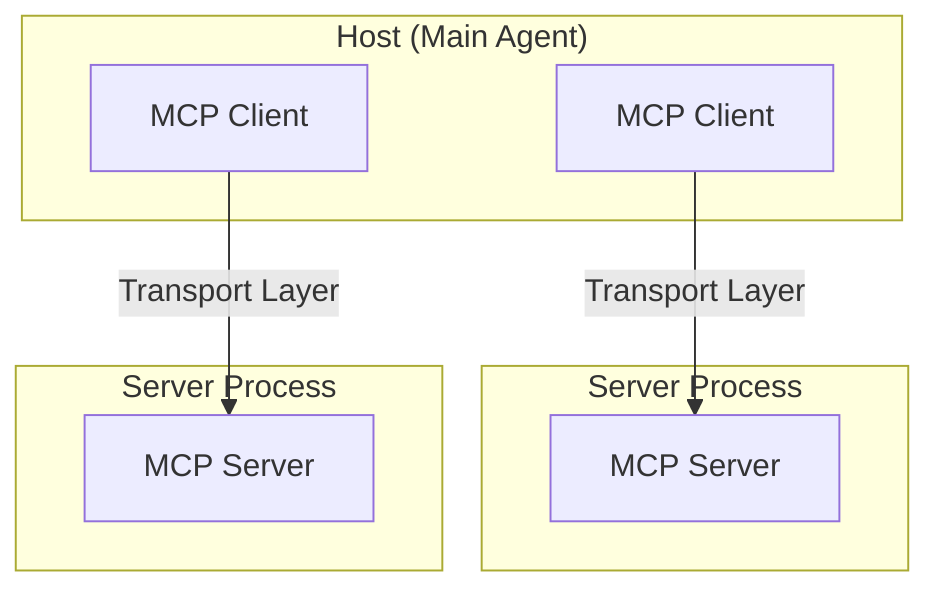
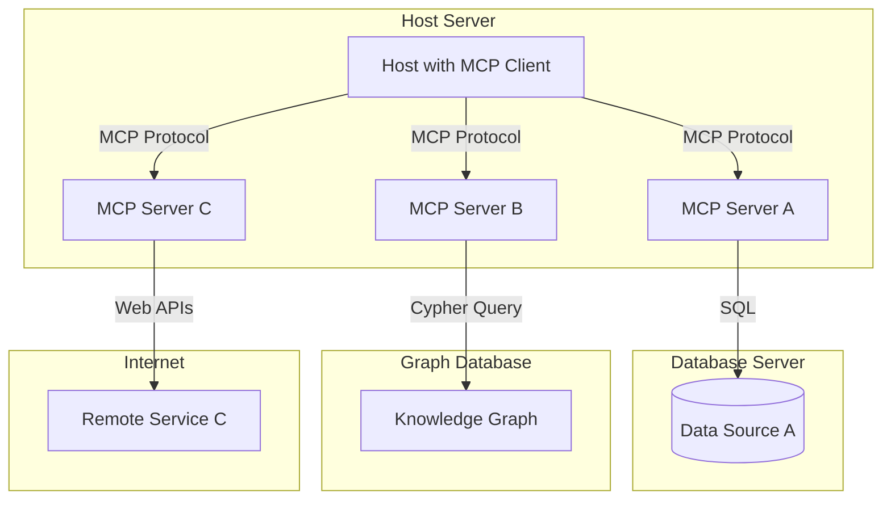
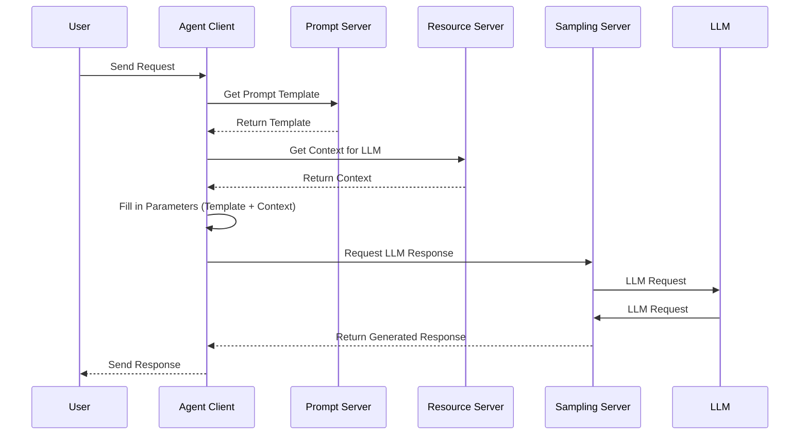

MCP Review

- [Capabilities Mapping](#capabilities-mapping)
- [MCP Design Basics](#mcp-design-basics)
- [Agent Catalogs](#agent-catalogs)
  - [MCP Tools as Catalog](#mcp-tools-as-catalog)
    - [Discovery - List tools:](#discovery---list-tools)
    - [Invocation - Call tools:](#invocation---call-tools)
  - [Agent Catalog Comparison](#agent-catalog-comparison)
- [Data Sources](#data-sources)
  - [Resources (MCP)](#resources-mcp)
  - [Data Source Comparison](#data-source-comparison)
- [Agent Clients](#agent-clients)
  - [Clients )MCP)](#clients-mcp)
- [Prompt Registry](#prompt-registry)
  - [MCP Prompt Registry](#mcp-prompt-registry)
- [LLM Interactions](#llm-interactions)
  - [Sampling (MCP)](#sampling-mcp)
- [Sample Sequences](#sample-sequences)
  - [MCP Simple Agent call](#mcp-simple-agent-call)
- [Sample Implementation](#sample-implementation)


# Capabilities Mapping


| Capability      |     | MCP                                                                  |
| --------------- | --- | -------------------------------------------------------------------- |
| Agent Catalogs  |     | [Tools](https://modelcontextprotocol.io/docs/concepts/tools) (?)     |
| Agent Providers |     | [Tools](https://modelcontextprotocol.io/docs/concepts/tools) (?)     |
| Data Sources    |     | [Resources](https://modelcontextprotocol.io/docs/concepts/resources) |
| Agent Clients   |     | [Clients](https://modelcontextprotocol.io/clients)                   |
| Prompt Registry |     | [Prompts](https://modelcontextprotocol.io/docs/concepts/prompts)     |
| LLM Calls       |     | [Sampling](https://modelcontextprotocol.io/docs/concepts/sampling)   |


# MCP Design Basics





MCP Servers expose 

# Agent Catalogs


## MCP Tools as Catalog

Even though MCP doesn't contain a catalog of agents per se (instead architects agents as multiple servers/clients) the tools capability allows servers to expose endpoints that allow discovery and invocation of tools that can be used by the LLM (or a "main" agent).

Tools are defined as:

```
{
  name: string;          // Unique identifier for the tool
  description?: string;  // Human-readable description
  inputSchema: {         // JSON Schema for the tool's parameters
    type: "object",
    properties: { ... }  // Tool-specific parameters
  }
}
```

Servers expose these tools via two methods:

### Discovery - List tools:

```
tools/list
```

### Invocation - Call tools:

```
tools/call
```

These tools can be the entry point for other agents called from a "main" agent.

## Agent Catalog Comparison

The main difference between 

# Data Sources


## Resources (MCP)

## Data Source Comparison

# Agent Clients


## Clients )MCP)

# Prompt Registry

## MCP Prompt Registry

MCP has a prompt type of resource that allows agents to "ask" for prompt templates to fill in an use in calls to llms (using sampling as below?). This can allow advanced agentic behavior 

# LLM Interactions

## Sampling (MCP)

Main reference: [Sampling](https://modelcontextprotocol.io/docs/concepts/sampling)

One interesting feature of MCP is the capability to directly call LLMs for completions via the same protocol.
This allows an agent to decide when to call an LLM to make decisions based on the context on what to call next (for example), generating a response, expanding on a user request or any other separate request.

# Sample Sequences

## MCP Simple Agent call



# Sample Implementation

